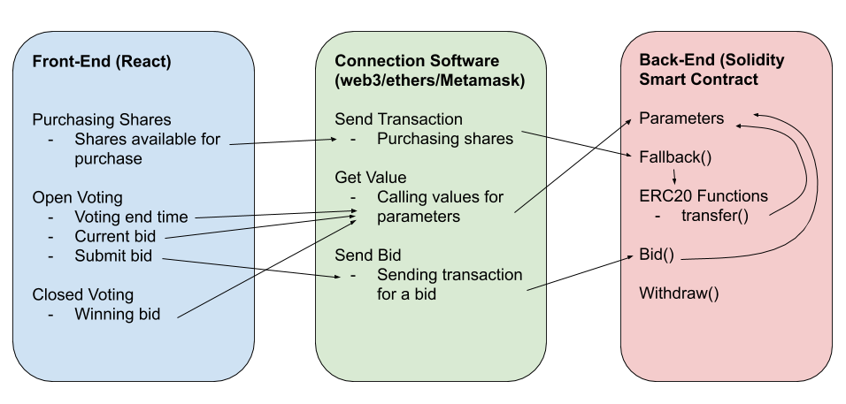

# Architecture Plan

## Goal
This smart contract is a token that allows users to securely buy into and bid on weeks on which they would be able to use a timeshare property. There is a limited supply of tokens, which could be bought with ethereum which represent shares of the property. These tokens can be used to bid on weeks during each season (e.g. 4 months). Before each season, a voting phase is held. This voting phase consists of token owners bidding on a specific week in a season with tokens. By bidding, these tokens are not lost forever, but only for the current season. After the end of each season, everyone's balance is set to the amount of tokens they had before voting for it started. If shares are not completely sold, they can be purchased at any time as well.

## Data
| Name | Type | Structure | Visibility | Purpose |
| ---- | ---- | --------- | ---------- | ------- |
| openVoting | bool | n/a | private | track if voting is open or not|
| endTime | uint | n/a | public | time when voting closes or starts|
| allottedBids | mapping | (address => uint) | public | total number of bids allowed per address depending on shares|
| remainingBids | mapping | (address => uint) | public | remaining bids left per address|
| Bid | struct | {address, amount} | n/a | structure to contain bid & address information|
| currentBid | mapping | (uint => mapping (address => uint)) | track each users current bids for a week |
| highestBid | mapping | (uint => Bid) | public | track the highest bid per week (with data)|

## Functions
| Function name | Parameters | Description |
|--|--|--|
| _`fallback`_ | None | Used to purchase tokens(I.E. shares of the timeshare) |
| `bid` | week, amount | Place bid of a certain number of tokens for a certain week |
| `withdraw` | Amount | An owner only function that allows them to withdraw money used for buying shares |
| ERC20 Functions | Many | Used to call transfers, balances, etc |
| `<parameters>` | Many | smart contract parameters that can be called for values (balances, endTime, etc) |

## Flowchart

## Type of Architecture
 - *Token* (allows for transferring, etc)
 - Using openzepplin ERC-20 code as base (allows for using a pre-tested and reliable base)
 - Can be customized & good for representing fractional ownership of property
